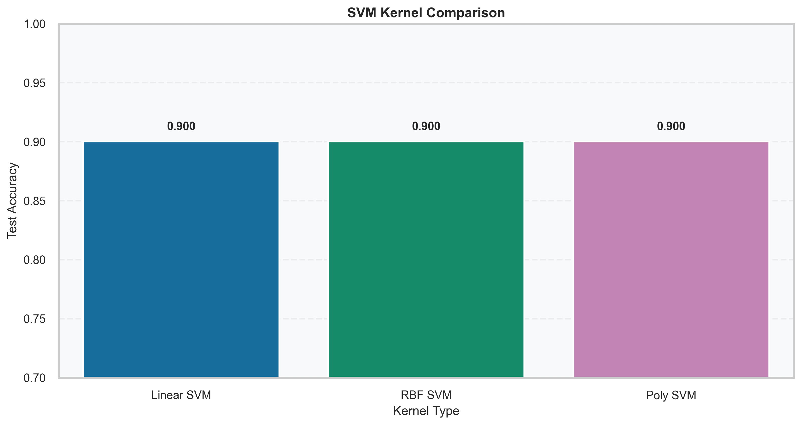
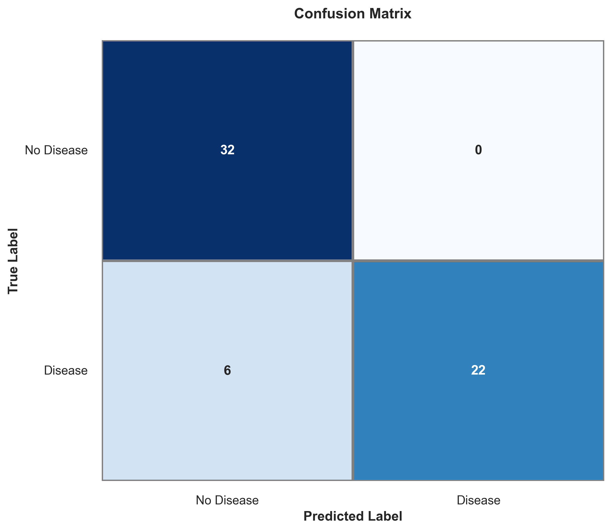
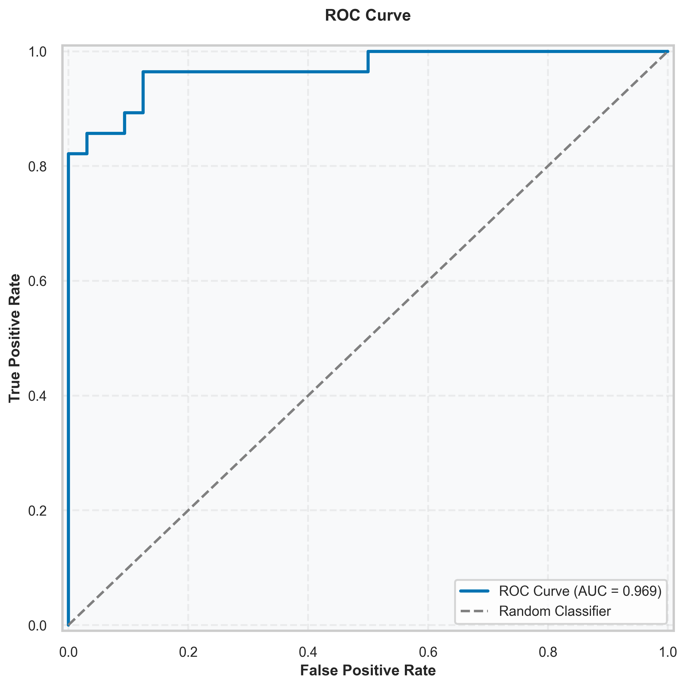

# Heart Disease Classification with SVM

Project tugas Pembelajaran Mesin yang berfokus pada satu algoritma: Support Vector Machine (SVM).
Dataset yang dipakai adalah Cleveland Heart Disease dataset dalam format lokal.

## Dataset

Sumber dataset yang digunakan pada proyek ini:

- Kaggle: https://www.kaggle.com/datasets/cherngs/heart-disease-cleveland-uci/data

Context penting dari dataset tersebut:

- Data ini merujuk pada dataset yang sebelumnya populer di Kaggle (ronitf/heart-disease-uci),
  tetapi versi tersebut memiliki beberapa deskripsi dan nilai yang dilaporkan kurang tepat.
- Dataset pada repo ini memakai versi yang sudah diolah ulang (re-processed) dan
  sudah di-cross-check terhadap sumber asli UCI.
- Referensi sumber asli UCI:
  https://archive.ics.uci.edu/ml/datasets/Heart+Disease

## Kenapa proyek ini dibuat

Tujuan utama proyek ini adalah menyusun alur eksperimen SVM yang rapi dari awal sampai evaluasi:

- cek kualitas data,
- eksplorasi fitur penting,
- preprocessing yang aman dari data leakage,
- pemilihan kernel,
- tuning hyperparameter,
- evaluasi model final.

## Struktur folder

- dataset/heart_cleveland.csv
- notebooks/svm.ipynb
- results/images/

## Ringkasan eksperimen

Eksperimen dilakukan hanya pada keluarga SVM:

- Linear SVM
- RBF SVM
- Polynomial SVM

Setelah perbandingan kernel, dilakukan GridSearchCV untuk memilih konfigurasi terbaik.

## Hasil akhir (run terbaru)

- Best parameter: kernel=linear, C=1
- Best cross-validation accuracy: 0.8148
- Test accuracy: 0.9000
- ROC-AUC: 0.9688

Classification report (test set):

- Tidak Ada Penyakit: precision 0.84, recall 1.00, f1-score 0.91
- Ada Penyakit: precision 1.00, recall 0.79, f1-score 0.88

Interpretasi singkat:
Model sudah kuat untuk klasifikasi biner pada data uji. Recall kelas Ada Penyakit masih bisa ditingkatkan jika target tugas berikutnya adalah menekan false negative.

## Visual output

Semua plot tersimpan di results/images:

- target_distribution.png
- numeric_distributions.png
- numeric_boxplots.png
- categorical_distributions.png
- correlation_matrix.png
- svm_kernel_comparison.png
- confusion_matrix.png
- roc_curve.png

Contoh preview:





## Cara menjalankan

1. (Opsional) Buat virtual environment.
2. Install dependensi dari file requirements.
3. Buka notebook notebooks/svm.ipynb.
4. Jalankan cell dari atas ke bawah.

Contoh instalasi cepat (Windows PowerShell):

```bash
python -m venv .venv
.venv\Scripts\Activate.ps1
pip install -r requirements.txt
```

Atau jika tidak pakai virtual environment:

```bash
pip install -r requirements.txt
```

## Catatan

Proyek ini sengaja tidak membandingkan algoritma lain (Random Forest, XGBoost, dll.) karena scope tugas dibatasi pada SVM.
